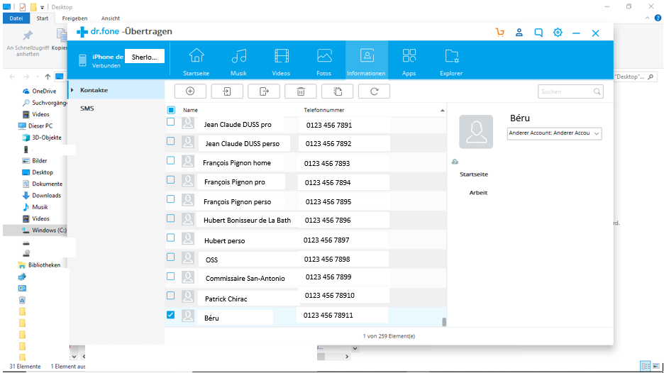
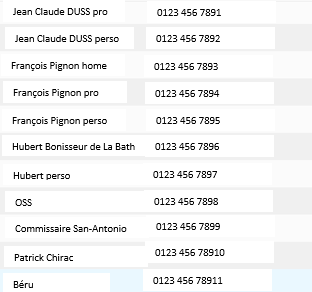

# ocr_for_contacts_list

|   | 
|:--:| 
| *examples of screenshots to extract info from* |

extracted list:

```
{
   "Jean Claude DUSS pro":"01234567891",
   "Jean Claude DUSS perso":"01234567892",
   "Frangois Pignon home":"01234567893",
   "Frangois Pignon pro":"01234567894",
   "Frangois Pignon perso":"01234567895",
   "Hubert Boniseur de La Bath":"01234567896",
   "Hubert perso":"01234567897",
   "oss":"01234567898",
   "Commisssire San-Antonio":"01234567899",
   "Patrick Chirac":"012345678910",
   "Béru":"012345678911"
}
```

## disclaimer:
- there are better solutions for exporting a contact list from a smartphone (e.g. [here](https://itunes.apple.com/us/app/my-contacts-backup-share-copy-and-export-in-vcf/id1152926717?mt=8))
- the present script is **just for getting familiar** with some off-the-shelf OCR tools

## motivation:
- **export a simple phone contact list** (in particular from **iOS**)
- some pieces of software (e.g. dr.fone) are able to do it but you have to **pay to export** the final list

## principle:
- go to any software that can **display your contact list** when connecting your phone (e.g. [dr.fone](http://www.dr-fone.com/))
- make **screenshots** of every sections (I managed to pack my 250 contacts in 25 groups of 11)
	- help: on Windows, press the `Windows`+`PrtScn` buttons on your keyboard to save the screen
- automate the **cropping** to keep relevant info (need to set the parameters manually)
- save these images in the `"/data"` directory

|   | 
|:--:| 
| *cropped image = input of OCR* |

## known issues:
- the OCR used ([tesseract](https://en.wikipedia.org/wiki/Tesseract_(software))) may make errors (for instance "0" read as "(")
- worse, sometimes the dr.fone software ignores a name or a num, leaving a blank cell
    - the python script cannot intrepret that a correct the odd number when match
    - solution could be to force the OCR to **read line by line** and **not column by column** as it is the case by default
- I **manually add patches** based on the errors I met. Corresponding lines are commented with `# hack!:`

## further work:
- generate a `.vcf` file from the output `.json` (maybe using excel first)
- [example](https://www.techrrival.com/convert-excel-xlsx-to-vcard-vcf-file/)